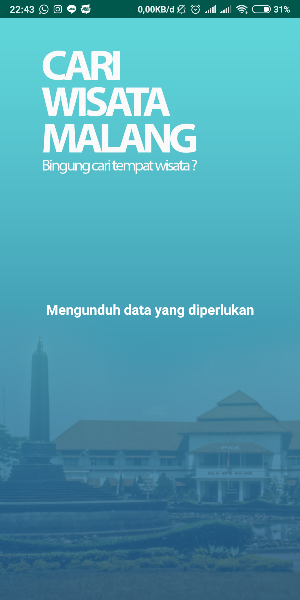
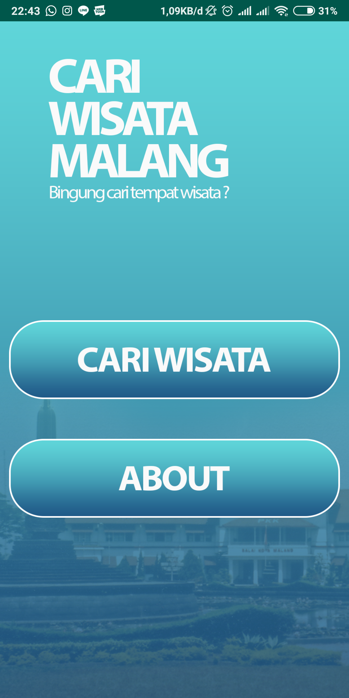
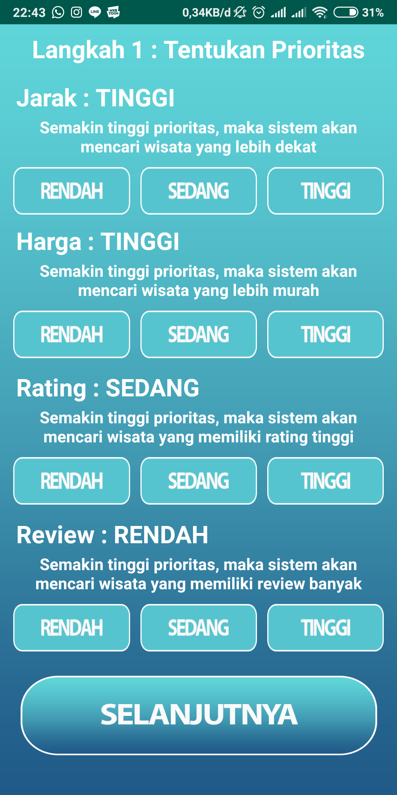
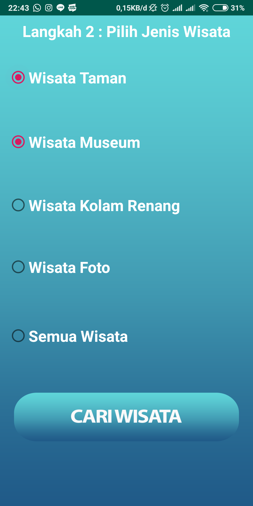
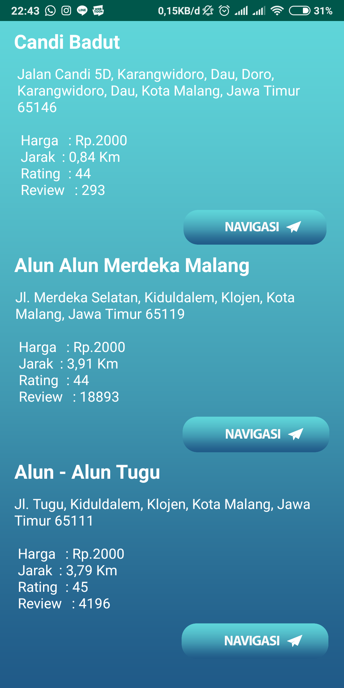

# Cari Wisata Malang Kota

## Sekilas Tentang Aplikasi
  Aplikasi ini merupakan sebuah aplikasi yang bertujuan memilih wisata di dalam
  Malang yang sesuai dengan keinginan pengguna. Pengguna hanya memasukkan input
  kriteria yang diinginkan dan jenis wisata yang diinginkan, aplikasi akan mencari
  wisata yang sesuai dengan kriteria tersbut.

  Aplikasi ini menerapkan algoritme TOPSIS dalam melakukan perhittungan pencarian
  wisata. ALgoritme ini dipilih karena perhitungannya yang cukup sederhana dan
  tidak memerlukan _resource_ yang berat sehingga cocok digunakan dalam _platform_
  mobile yang memiliki keterbatasan sumber daya tenaga dan komputasi.

## Kebutuhan
  Aplikasi ini memerlukan akses koneksi Internet dan GPS.
  - Koneksi Internet diperlukan untuk mengunduh data ovjek wisata yang tersimpan
    dalam server.
  - GPS digunakan untuk mendapatkan lokasi penggguna saat ini. Hal ini diperlukan
    karena salah satu kriteria yang dipakai adalah jarak, sehingga aplikasi perlu
    mengetahui lokasi pengguna untuk mengetahui jarak pengguna dengan tempat Wisata
    yang ingin dicari.

## Tangkapan Layar
  Berikut merupakan contoh tangkapan layar dari aplikasi Cari Wisata Malang Kota
  

  
  

  - Splashscreen, ditampilkan saat aplikasi pertamakali dijalankan dimana pada
    saat tersebut dilakukan pengunduhan data objek wisata dari server.

  

  
  

  - Menu, ditampilkan ketika aplikasi selesai mengunduh data objek wisata. digunakan
    untuk memilih menu untuk mencari wisata atau about.

  

  
  

  - Bobot, halaman ini ditampilkan ketika pengguna memilih menu cari wisata. halaman
    ini digunakan untuk melakukan input kriteria yang diinginkan pengguna. kriteria
    ini nantinya akan dijadikan dasar perhitungan pencarian Wisata.

  

  
  

  - Jenis Wisata, halaman ini ditampilkan ketika pengguna telah melakukan input
    kriteria, dan memilih jenis wisata yang ingin dicari oleh pengguna.

  

  
  

  - Rekomendasi, halaman ini ditampilkan ketika pengguna telah memilih jenis Wisata
    yang diinginkan dan melakukan pencarian wisata. Setelah pencarian wisata selesai,
    rekomendasi akan ditampilkan di halaman ini. Tombol navigasi apabila ditekan
    akan melakukan navigasi melalui aplikasi google Maps.

## Cara Penggunaan Aplikasi
   1. Jalankan Aplikasi, tunggu hingga masuk ke dalam menu utama.
   2. Pada menu utama, pilih Cari Wisata.
   3. Masukkan bobot yang diinginkan dari setiap kriteria
   4. Pilih jenis wisata yang ingin dicari
   5. Tunggu hingga aplikasi selesai melakukan pencarian objek Wisata
   6. Hasil rekomendasi akan menampilkan 3 objek wisata teratas lengkap dengan
     detail wisata dan tombol navigasinya.

## Catatan Personal
   Aplikasi ini merupakan proyek skripsi saya, sehingga _User Interface_ dan
  _User Experience_ mungkin masih kurang bagus. Namun, Kebutuhan fungsional dari
   aplikasi ini sudah terpenuhi. Mungkin kedepannya saya ingin _remake_ aplikasi
   ini dengan tampilan dan pengalaman yang lebih menarik. Aamiin.

## Lisensi

